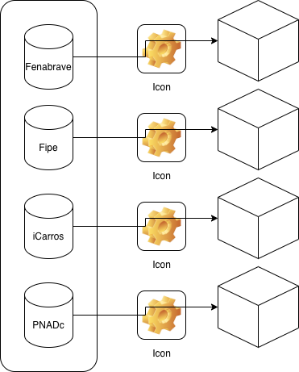
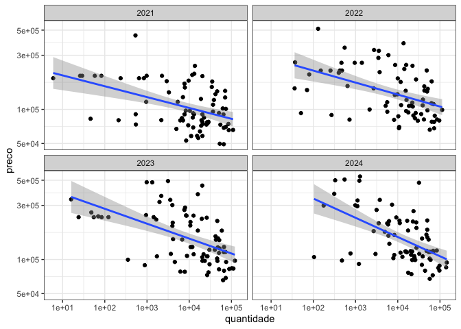
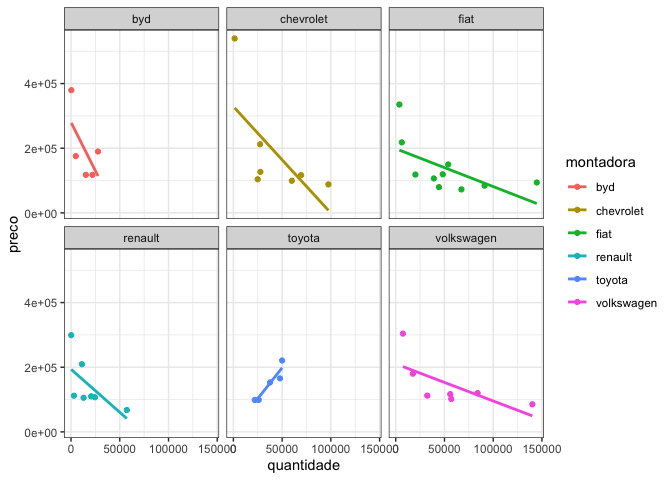

<!-- README.md is generated from README.Rmd. Please edit that file -->

# demandacarros

<!-- badges: start -->

[](https://lifecycle.r-lib.org/articles/stages.html#experimental)
<!-- badges: end -->

A ideia aqui é desenhar o processo de estimar a demanda por carros novos
no Brasil. A ideia é rodar um BLP bem próximo do artigo original. A
equação principal deve ser algo nesse sentido:

q\_{ji} = f(p\_j, X\_j, v\_i)

A ideia é que a quantidade consumida do carro de modelo *j* seja função
de:

1.  p\_j: Preço do modelo *j*;
2.  X\_j: Características observáveis do modelo *j*;
3.  v\_i: Características observáveis do consumidor *i*.

> Rever essas notações.

Em função disso, vamos precisar 4 dados diferentes e de fontes diversas.

| Informação                     | Fonte                         |
| ------------------------------ | ----------------------------- |
| Quantidade                     | Fenabrave                     |
| Preço                          | Fipe                          |
| Caracteísticas dos modelos     | icarros + fichatecnica.com.br |
| Caracteísticas dos consumidors | PNADc                         |



``` r
library(carrosbr)
#> Loading required package: fenabrave
#> Loading required package: fipe
library(tidyverse)
#> ── Attaching core tidyverse packages ──────────────────────── tidyverse 2.0.0 ──
#> ✔ dplyr     1.1.4     ✔ readr     2.1.5
#> ✔ forcats   1.0.0     ✔ stringr   1.5.1
#> ✔ ggplot2   3.5.0     ✔ tibble    3.2.1
#> ✔ lubridate 1.9.3     ✔ tidyr     1.3.1
#> ✔ purrr     1.0.2
#> ── Conflicts ────────────────────────────────────────── tidyverse_conflicts() ──
#> ✖ dplyr::filter() masks stats::filter()
#> ✖ dplyr::lag()    masks stats::lag()
#> ℹ Use the conflicted package (<http://conflicted.r-lib.org/>) to force all conflicts to become errors
# p_j
precos <- precos_fipe
head(precos)
#> # A tibble: 6 × 4
#> # Groups:   montadora, modelo [2]
#>   montadora modelo   ano  preco
#>   <chr>     <chr>  <int>  <dbl>
#> 1 audi      a3      2003  49239
#> 2 audi      a3      2004  52329
#> 3 audi      a3      2005  61664
#> 4 audi      a3      2006  64991
#> 5 bmw       x1      2022 284474
#> 6 bmw       x1      2023 301838

# q_j
quantidades <- emplacamento_anual
head(quantidades)
#> # A tibble: 6 × 5
#>   tipo       montadora modelo  quantidade   ano
#>   <chr>      <chr>     <chr>        <dbl> <int>
#> 1 veiculo    VW        GOL         180073  2003
#> 2 utilitario FIAT      STRADA       27921  2003
#> 3 veiculo    FIAT      PALIO       118756  2003
#> 4 utilitario VW        SAVEIRO      16097  2003
#> 5 veiculo    GM        CELTA       114690  2003
#> 6 utilitario GM        S10          14111  2003
```

Então podemos juntar os dados

``` r
dados <- quantidades %>%
  dplyr::mutate(
    modelo = tolower(modelo) %>%
      stringr::str_replace(" ", "-"),
    montadora = tolower(montadora),
    montadora = dplyr::case_when(
      montadora == "gm" ~ "chevrolet",
      montadora == "vw" ~ "volkswagen",
      montadora == "vw/fox" ~ "volkswagen",
      montadora == "vw/man" ~ "volkswagen",
      montadora == "vw-trucks-e-bus" ~ "volkswagen",
      montadora == "m.benz" ~ "mercedes-benz",
      montadora == "caoa chery" ~ "caoa-chery",
      TRUE ~ montadora
    ),
    modelo = dplyr::case_when(
      modelo == "fox/cross-fox" ~ "fox",
      modelo == "etios-hb" ~ "etios",
      modelo == "yaris-hb" ~ "yaris",
      modelo == "cruze-sedan" ~ "cruze",
      modelo == "cruze-hb" ~ "cruze-sport6",
      modelo == "hilux-sw4" ~ "sw4",
      modelo == "space-fox" ~ "spacefox",
      modelo == "crv" ~ "cr-v",
      modelo == "206ws" ~ "206",
      modelo == "city-hatch" ~ "city-hatchback",
      modelo == "320i" ~ "serie-3",
      montadora == "kia" & stringr::str_detect(modelo, "k\\d+") ~ "bongo",
      stringr::str_detect(modelo, "sprinter-") ~ "sprinter",
      montadora == "ford" & stringr::str_detect(modelo, "f(?=\\d+)") ~
        stringr::str_replace(modelo, "f", "f-"),
      montadora == "iveco" & stringr::str_detect(modelo, "daily-") ~ "daily",
      TRUE ~ modelo
    )) %>% 
  left_join(precos, by = join_by(montadora, modelo, ano))

head(dados)
#> # A tibble: 6 × 6
#>   tipo       montadora  modelo  quantidade   ano preco
#>   <chr>      <chr>      <chr>        <dbl> <int> <dbl>
#> 1 veiculo    volkswagen gol         180073  2003 17854
#> 2 utilitario fiat       strada       27921  2003 20078
#> 3 veiculo    fiat       palio       118756  2003 14501
#> 4 utilitario volkswagen saveiro      16097  2003 24965
#> 5 veiculo    chevrolet  celta       114690  2003 18571
#> 6 utilitario chevrolet  s10          14111  2003 37739
```

E olhar para o seu formato

``` r
ggplot(dados %>% filter(ano > 2020), aes(quantidade, preco)) + 
  geom_point() + 
  geom_smooth(method = "lm") + 
  scale_x_log10() + 
  scale_y_log10() +   
  facet_wrap(~ano) +
  theme_bw()
#> `geom_smooth()` using formula = 'y ~ x'
#> Warning: Removed 88 rows containing non-finite outside the scale range
#> (`stat_smooth()`).
#> Warning: Removed 88 rows containing missing values or values outside the scale range
#> (`geom_point()`).
```



Olhar para marcas selecionadas

``` r
destaques <- c("byd", "fiat", "renault", "volkswagen", 
               "toyota", "chevrolet")
dados %>% 
  filter(ano == 2024, montadora %in% destaques) %>% 
  ggplot(aes(quantidade, preco, col = montadora)) + 
  geom_point() + 
  geom_smooth(method = "lm", se = FALSE) + 
  facet_wrap(~montadora) +
  theme_bw()
#> `geom_smooth()` using formula = 'y ~ x'
#> Warning: Removed 3 rows containing non-finite outside the scale range
#> (`stat_smooth()`).
#> Warning: Removed 3 rows containing missing values or values outside the scale range
#> (`geom_point()`).
```


